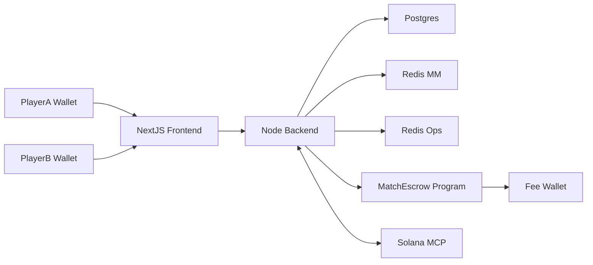

## Guess5 Escrow Architecture (Simplified)

This describes the **final simplified architecture** for Guess5 using a single
Solana escrow program and a lean backend/frontend integration.

---

## High-Level Flow

---

## On-Chain: MatchEscrow Program

- **Program ID**: `SMART_CONTRACT_PROGRAM_ID` / `NEXT_PUBLIC_SMART_CONTRACT_PROGRAM_ID`
- **Primary account (PDA)**: `MatchEscrow` (called `game_escrow` in code) derived as:
  - Seeds: `["match", match_id (u128 LE)]`

Stored fields (conceptually):
- `match_id: u128`
- `player_a: Pubkey`
- `player_b: Pubkey`
- `entry_fee_lamports: u64`
- `is_paid_a: bool`
- `is_paid_b: bool`
- `game_status`: Pending / Active / Settled
- `winner: Option<Pubkey>`
- `result_type`: Unresolved / Win / DrawFullRefund / DrawPartialRefund
- `created_at: i64`
- `timeout_at: i64`

### Instructions

- **initialize_match**: Player A creates the PDA with players, entry fee, timeout.
- **deposit**: Either player deposits the entry fee; when both have deposited,
  status becomes Active and funds live in the PDA.
- **submit_result**:
  - Accepts a flat `MatchResult` struct and a backend ed25519 signature:
    - `match_id: u128`
    - `winner_pubkey: [u8; 32]` (`[0; 32]` for draw)
    - `result_type: u8` (1=Win, 2=DrawFullRefund, 3=DrawPartialRefund/Timeout)
  - Verifies an ed25519 precompile instruction in the same transaction using
    the configured backend signer pubkey and the Borsh-serialized `MatchResult`.
  - Stores `winner` and `result_type` on the `MatchEscrow` account.
- **settle**:
  - Anyone can call once result is submitted or timeout passed.
  - Payouts and fees are handled directly from the PDA using `invoke_signed`.
  - Fee schedule:
    - Win: ~5% fee from total pot (winner gets ~95%).
    - DrawFullRefund: 0% fee (full refund to both players).
    - DrawPartialRefund / timeout draw: ~5% fee with ~95% refunds.
    - Unresolved timeout (both deposited, no result): higher penalty fee path.
  - Sends fees to `FEE_WALLET_ADDRESS`.
- **refund_if_only_one_paid** (cancel path):
  - After timeout, if only player A or player B has deposited, refunds that
  player and marks the match as settled/expired.

---

## Backend Responsibilities

- Owns **all on-chain integration**:
  - Derives PDAs for matches.
  - Creates `initializeMatch`, `deposit`, `submitResult`, `settle`, and
    `refund_if_only_one_paid` transactions via `escrowService`.
  - Signs `MatchResult` with `BACKEND_SIGNER_PRIVATE_KEY`.
  - Adds the ed25519 precompile instruction before `submit_result`.
- Persists match state, referrals, and payouts in **Postgres**.
- Uses **Redis MM** and **Redis Ops** for matchmaking and operational state.

Key modules:
- `backend/src/services/escrowService.ts`: Anchor-based client for the
  `MatchEscrow` program.
- `backend/src/utils/escrowSigning.ts`: Builds and signs `MatchResult` payloads
  using Ed25519 and Borsh serialization.
- `backend/src/controllers/escrowController.ts`: Exposes REST endpoints for
  initialize, deposit, submit-result, settle, and escrow state reads.

---

## Frontend Responsibilities

- Next.js app uses:
  - `NEXT_PUBLIC_API_URL` for all backend API calls.
  - `NEXT_PUBLIC_SOLANA_NETWORK` for wallet connections.
  - `NEXT_PUBLIC_SMART_CONTRACT_PROGRAM_ID` for display/debug.
  - `NEXT_PUBLIC_BACKEND_SIGNER_PUBKEY` and `NEXT_PUBLIC_FEE_WALLET_ADDRESS`
    for transparent UI and safety checks.
- Key components:
  - `EscrowDeposit.tsx`: asks backend for a deposit transaction and has the
    player sign/broadcast it.
  - `SubmitResult.tsx`: posts match results to backend, which signs and sends
    the on-chain `submit_result`.
  - `MatchStatusDisplay.tsx` / status pages: poll backend for match + escrow
    state and render status.

All complex on-chain logic (PDA math, Ed25519 messages, fee math) lives in the
backend + Solana program so the frontend stays light and fast for players.

